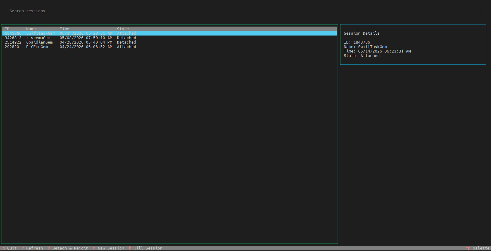

# VisScreen

VisScreen is a modern Terminal User Interface (TUI) for managing GNU `screen` sessions on Linux. It eliminates the need to manually list and copy session names, providing a visual, searchable, and interactive experience for rejoining, creating, and terminating screens.



## Features

- **Interactive Session List:** View all active screens with their IDs, names, timestamps, and states (Attached/Detached).
- **Search & Fuzzy Filter:** Instantly find sessions by typing in the search bar.
- **Visual Rejoin:** Select a session and press `Enter` to rejoin.
- **Auto-detach Support:** Press `d` to force a detach from another terminal and rejoin automatically.
- **Session Management:**
    - **Create:** Press `n` to create a new named session via a modal dialog.
    - **Kill:** Press `k` to safely terminate sessions with a confirmation prompt.
- **Detail Pane:** View extended session information in a dedicated sidebar.
- **Fast & Lightweight:** Built with Python and the [Textual](https://textual.textualize.io/) framework.

## Installation

### Prerequisites

- Python 3.8+
- GNU `screen` installed and in your `$PATH`.

### From Source

1. Clone the repository:
   ```bash
   git clone https://github.com/yourusername/VisScreen.git
   cd VisScreen
   ```

2. Install the package:
   ```bash
   pip install .
   ```

## Usage

Run the utility from your terminal:

```bash
visscreen
```

### Key Bindings

| Key | Action |
|-----|--------|
| `Enter` | Rejoin selected session |
| `d` | Detach and Rejoin selected session |
| `n` | Create a new session |
| `k` | Kill selected session |
| `r` | Refresh session list |
| `q` | Quit VisScreen |

## Development

To set up a development environment:

1. Create a virtual environment:
   ```bash
   python3 -m venv venv
   source venv/bin/activate
   ```

2. Install development dependencies:
   ```bash
   pip install -e ".[dev]"
   ```

3. Run tests:
   ```bash
   python3 -m unittest discover tests
   ```

## License

MIT
